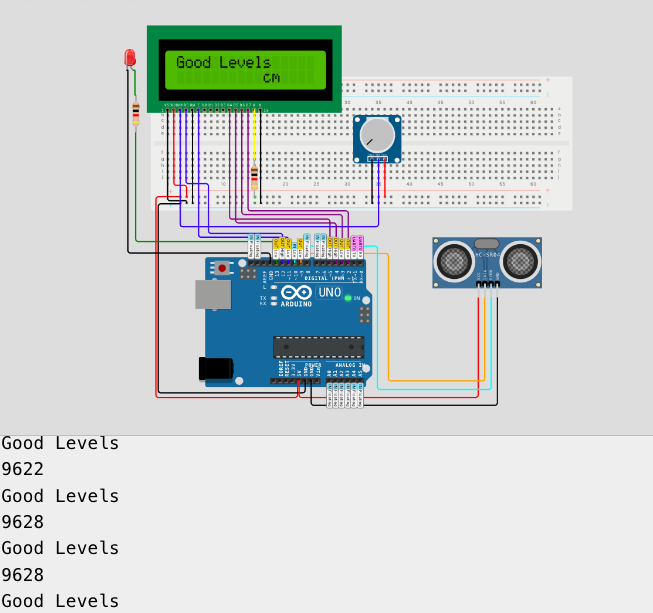

# E.P.I.S
Projekt Presentation: 

Välkommen till mitt projekt!
I detta arbetet har jag jobbat med att desgina en sensorbaserad varningssystem för riskhantering av vatten. 

Bakgrund och Motivation:

Utgångspunkten för detta projekt var en nyhetsartikel på Aftonbladet som rapporterade om översvämningar. Detta väckte min uppmärksamhet och fick mig att fundera över hur vi kan förebygga skador och rädda liv i händelse klimatförändringar samt dess konsekvenser.

Målet var att skapa en lösning med hjälp av en vattensensor, som skulle kunna upptäcka vatten och vidarebefordra relevanta data till en LCD-skärm. Genom detta skulle vi kunna ge tydliga varningar beroende på vattennivåerna och därigenom minimera risken för skador och förlust av liv.

Ursprunglig Fokus och Utvidgning:

I början var tanken att skapa en lösning endast för övervakning av vattennivåer. Men under arbetets gång övervägde jag även andra naturkatastrofer, såsom tsunamis. Jag funderade på möjligheten att utveckla en enhet som kunde ge varningar för olika scenarier. Ett exempel är att detektera ovanligt havsbeteende och avvikelse från kusten som indikationer på en möjlig tsunami.

Arbetsprocess: 

För att förstå och implementera projektet började jag med att fördjupa mig i Arduino genom att studera Tutorials Point och titta på Youtube-videor. Det var viktigt att förstå grundläggande funktioner och hur man kopplar samman olika komponenter på en Arduino-bräda.

Komponentlista och motivering
- LCD skärm: För display av varningsmeddelande och distans.
- Krets Bord: För att koppla samman alla komponenter till varandra.
- Arduino Bräda: För att kunna läsa av värden från sensorerna och
sammankoppla dem med samtliga sensorer.
- LED Lamp: Ska fungera som en varningslampa
- Resistor: För att ge resistans och gränslägga strömkret. Förhindrar att
glödlampan och LCD går sönder på grund av för hög volt.
- Potentiometer: reglerbar resistor då det kan vara bra att kunna kontrollera
strömmen.
- Distans sensor: Ska mäta avståndet genom att skicka ut pulserande
ljudvågor (Trigger) och se hur lång tid det tar för ljudvågorna att komma tillbaka som ett eko (Echo) efter att ha nått mottagaren/objektet.

GOOD LEVELS:

ISSUING WARNING:

